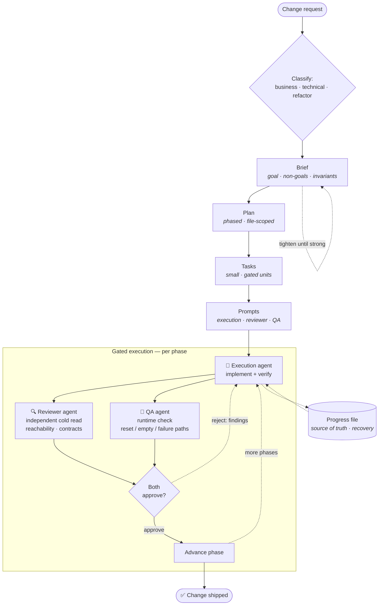
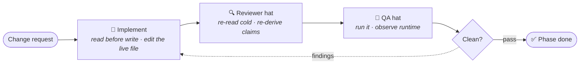

# change-delivery

```bash
npx skills add KhalifaGad/change-delivery
```

**An agent skill for landing large or refactor changes reliably — it interrogates the change into a sharp brief, plans the phases, and drives execution through independent review/QA gates, so an agent can't plan the wrong thing or quietly ship broken work.**

It exists for the changes that are too big to one-shot: multi-phase refactors, migrations, and features that touch many files and need sequencing. Hand one of those to an agent in a single pass and it'll often return something that *looks* right — compiles, type-checks, reads plausibly — while quietly shipping broken or half-applied work. `change-delivery` is a methodology, not a wrapper: it decomposes the change into gated phases and brackets the risky middle with adversarial checks at **both ends** — pressuring your brief *before* it plans, and verifying the work *before* it ships.

---

## Why it's different

Most "AI dev workflow" prompts help you *plan*. change-delivery is built to *land the change*, and to be trustworthy doing it:

- **It interrogates the change before it plans.** It treats your change request as a draft to pressure: it inspects the repo to learn what *this* codebase treats as cross-cutting and high-risk, challenges vague goals and missing invariants, and asks the focused questions you didn't think to answer — refusing to advance until the brief is actually strong. Half of shipping the wrong thing is *planning* the wrong thing; this catches it first.
- **Separation of roles.** The agent that writes the code never reviews or QAs it. A fresh, independent agent re-reads the change cold and tries to break it. Independence is the mechanism — self-review rubber-stamps.
- **Grounding rules** — read before reference, evidence over assertion, and two learned the hard way:
  - **Reachability before change** — a file existing isn't proof it's *used*. Confirm it's reachable from a route/entry point before editing it. (A dead look-alike compiles, reviews fine on its own terms, and ships nothing.)
  - **Build green is not "works"** — a passing build/test/lint proves it compiles, not that it behaves. User-facing changes need a *runtime* check across the reset/empty/failure paths, not just the happy path.
- **Gated execution with recovery.** Phases advance only on reviewer + QA approval; a progress file externalizes state so work survives crashes, stalls, and hand-offs.

## How it works

A change is classified (`business` · `technical` · `refactor` — or a hybrid that pulls in both playbooks), shaped into a **brief** through focused questions, then turned into a **plan**, a **task breakdown**, and **execution / reviewer / QA prompts**. After the brief, a **rollback assessment** decides per layer (DB, API, deploy, config) what a safe undo looks like and folds it into the plan. Execution then runs in **gated phases** — the agent that writes the code never approves it; an independent reviewer and QA each try to break the work, and a phase advances only when **both** pass:



The forked arrows are the point: the execution agent's work goes to **two separate** verifiers, both must approve, and any rejection loops straight back. The progress file is the recovery spine — work survives a crash, stall, or hand-off.

The pipeline produces, in order: **brief** (goal · non-goals · invariants · success criteria) → **plan** (phased · file-scoped · verification per phase) → **tasks** (small, gated units) → **prompts** (execution / reviewer / QA) → a **progress file** (the running source of truth and recovery log).

### Single-agent fallback

No sub-agents in your harness? The same gates run **sequentially in one agent that changes hats** — implement, then re-read cold as a reviewer, then exercise it at runtime as QA. Independence is *simulated* by re-deriving every claim from freshly re-read code and real output rather than memory, so it's weaker than true separate agents — but it still catches what build-green hides:



## Why you can trust it

The gates aren't theater. In one multi-phase feature delivery, the independent review/QA step caught work a green build would have shipped — caught *because* the change ran through the process instead of a single pass:

- a composite **database index the query planner would never use** (a column-to-column comparison a B-tree can't serve) — pure write-cost, no read benefit;
- an entire **phase implemented against dead code** — a component that compiled and type-checked but was never mounted on a route;
- a **filter that only ever returned the first page** of results, because filtering ran client-side over a capped fetch;
- a **"Reset" button and a date selector that silently did nothing**, due to collapsed state-setter calls racing each other;
- a **count badge that under-counted**, because two hand-maintained status lists had drifted apart.

Every one passed a green build. None survived an independent review + runtime check.

**Watch one fire yourself.** [`change-delivery-demo`](https://github.com/KhalifaGad/change-delivery-demo) is a focused look at *just* the verification layer: a tiny green-building app with two failure modes planted — a dead look-alike component and a build-green-but-broken filter — and a [real reviewer + QA run](https://github.com/KhalifaGad/change-delivery-demo/blob/main/TRANSCRIPT.md) catching both in under a minute. One guardrail in isolation — not the whole job, but the part you can clone and run.


**And it's battle-tested.** The gated-delivery method behind change-delivery was forged over ~10 weeks of real product work — landing multi-phase changes like a seller-portal extraction refactor and a database-architecture hardening across two production codebases, through 100+ independent review/QA passes. The skill is the distilled, reusable form of that process.

## Modes (scale the ceremony to the change)

Gated multi-agent execution is powerful but expensive. Pick a mode up front:

- **Lite** — small, low-risk, well-understood changes. Brief + short task list, one execution pass, one honest self-review (the single-agent fallback). No separate sub-agents.
- **Standard** — a normal feature/refactor. Full artifacts, gated execution; collapse reviewer+QA on low-risk phases, reserve the full pair for the risky ones (migrations, shared code, money/auth/multi-tenant).
- **Full** — high-risk or compliance-sensitive. Everything, reviewer **and** QA on every phase.

## Install

`change-delivery` is a standard **Agent Skill** — a folder with [`SKILL.md`](SKILL.md) (frontmatter `name` + `description`) and a [`references/`](references/) directory. It's plain markdown; drop it where your agent discovers skills.

### Recommended: the `skills` CLI (one command, every harness)

```bash
npx skills add KhalifaGad/change-delivery
```

This installs the whole skill — `SKILL.md` **and** `references/` — as a universal skill that works across Claude Code, Codex, Cursor, Cline, Gemini CLI, Amp, and more. It auto-detects your agent and installs non-interactively. By default it installs **project-local** (under `.agents/skills/` in the current directory); run it where you want the skill scoped, or use the CLI's global option for an all-projects install.

### Manual (git clone)

If you'd rather drop the folder in directly:

**Claude Code**
```bash
# user-level (all projects)
git clone https://github.com/KhalifaGad/change-delivery ~/.claude/skills/change-delivery
# or project-level
git clone https://github.com/KhalifaGad/change-delivery <your-project>/.claude/skills/change-delivery
```

**Codex**
```bash
git clone https://github.com/KhalifaGad/change-delivery ~/.codex/skills/change-delivery
```

**Any other harness** — place `SKILL.md` + `references/` wherever your agent loads skills/playbooks, then point it at `SKILL.md`. The paths inside the skill are all relative, so it works from any install location.

[`claude-command.md`](claude-command.md) is an optional slash-command launcher for harnesses that invoke via slash commands — adapt or ignore per your setup.

> Exact skill directories vary by tool and version; check your harness's docs if the paths above differ.

## Using it

Invoke the skill (e.g. `/change-delivery`) and describe your change. It inspects the repo, classifies the change, and interviews you until the brief is sharp — pushing back on vague goals, missing invariants, and weak rollout assumptions — then writes the plan → tasks → prompts, and on request orchestrates gated execution (or hands you the prompts to run yourself). It won't advance an artifact until it's strong enough, and writes files automatically once the decisions are no longer ambiguous.

## Repository layout

```
change-delivery/
├── SKILL.md                         # the skill (entry point)
├── claude-command.md                # optional slash-command launcher
├── references/
│   ├── grounding-rules.md           # canonical anti-hallucination rules (single source)
│   ├── artifact-standards.md        # what a strong brief/plan/tasks/prompt looks like
│   ├── business-change.md           # business-change emphasis + questions
│   ├── technical-change.md          # technical-change emphasis + feature-flag heuristic
│   ├── refactor-change.md           # refactor emphasis (preserved behavior)
│   ├── prompt-generation.md         # execution/reviewer/QA prompt shapes
│   ├── execution-orchestration.md   # orchestrator steps + recovery/stall/blocker
│   ├── progress-template.md         # fillable progress file (evidence slots)
│   └── rollback-approaches.md       # per-layer rollback options
├── README.md
└── LICENSE
```

## Contributing

Issues and PRs welcome — especially real-world failure modes the grounding rules should catch, and harness-specific install notes.

## License

[MIT](LICENSE) © Khalifa Gad
